# CVitae - Elite AI Resume Application 🚀

[](https://opensource.org/licenses/MIT)
[](https://www.oracle.com/java/)
[](https://spring.io/projects/spring-boot)
[](https://reactjs.org/)
[](https://www.typescriptlang.org/)
[](https://groq.com/)

## 🎯 Overview

**CVitae** is a cutting-edge, AI-powered resume optimization platform that transforms your master resume into targeted, ATS-optimized resumes tailored for specific job opportunities. Leveraging the power of **Groq AI** and professional **Jake's LaTeX formatting**, CVitae delivers enterprise-grade resume generation with a sleek, minimalist interface.

### 🌟 Why CVitae?

- **🤖 AI-Driven Intelligence**: Advanced job analysis and resume tailoring using Groq's lightning-fast LLM
- **📊 ATS Optimization**: Ensures your resume passes Applicant Tracking Systems with targeted keyword matching
- **🎨 Professional Design**: Jake's LaTeX template provides recruiter-approved, clean formatting
- **⚡ Real-time Processing**: Instant resume generation and optimization
- **💬 AI Assistant**: Integrated chatbot for resume improvement suggestions and career guidance

## ✨ Core Features

### 🚀 AI-Powered Resume Engine

- **Intelligent Job Analysis**: Groq AI extracts key requirements from job postings
- **Smart Resume Tailoring**: Automatically optimizes content for specific roles
- **ATS Optimization**: Ensures compatibility with Applicant Tracking Systems
- **Keyword Matching**: Strategic placement of relevant industry keywords

### 📄 Professional Document Generation

- **Jake's LaTeX Template**: Industry-standard, recruiter-approved formatting
- **Multi-Format Export**: PDF, PNG, JPG, and raw LaTeX code
- **High-Quality Output**: Publication-ready documents with precise typography
- **Mobile-Optimized**: Responsive design for all device types

### 💬 AI Assistant & Chat

- **Intelligent Chatbot**: Real-time resume improvement suggestions
- **Career Guidance**: AI-powered advice for job applications
- **Content Enhancement**: Suggestions for better phrasing and impact
- **Interactive Feedback**: Conversational interface for iterative improvements

### 🎨 Modern User Experience

- **Minimalist Design**: Clean, professional black & white interface
- **Smooth Animations**: Framer Motion for engaging interactions
- **Intuitive Workflow**: Step-by-step guided process
- **File Upload Support**: Drag-and-drop for resumes and job postings
- **Real-time Preview**: Instant feedback during resume creation

### 🔧 Developer & Admin Tools

- **Administrative Dashboard**: System monitoring and management
- **Health Monitoring**: Real-time application status and metrics
- **Debug Tools**: Comprehensive logging and error tracking
- **API Testing**: Built-in endpoints for development and testing

## 🏗️ System Architecture

CVitae follows a modern microservices architecture designed for scalability, maintainability, and high performance.

```
CVitae Ecosystem
├── 🌐 Frontend (React + TypeScript)
│   ├── React 18.2.0 + TypeScript 5.2.2
│   ├── Tailwind CSS + Framer Motion
│   ├── Vite Build System
│   └── Progressive Web App Features
│
├── 🚀 Backend API (Java Spring Boot)
│   ├── Spring Boot 3.2.0 + Java 17
│   ├── Spring Security + JPA
│   ├── RESTful API Design
│   └── Admin & Monitoring Tools
│
├── 🧠 AI Processing Service (Groq Integration)
│   ├── Groq AI LLM Integration
│   ├── Job Analysis Engine
│   ├── Resume Optimization Logic
│   └── Natural Language Processing
│
├── 📄 LaTeX Compilation Service (Python)
│   ├── Flask-based Microservice
│   ├── LaTeX Template Engine
│   ├── Multi-format Export (PDF/PNG/JPG)
│   └── Document Quality Optimization
│
└── 🗄️ Data Layer
    ├── PostgreSQL Database (Supabase)
    ├── Resume & Job Storage
    ├── Chat History Management
    └── User Session Tracking
```

## 🛠️ Technology Stack

### 🖥️ Frontend Technologies

| Technology          | Version | Purpose                           |
| ------------------- | ------- | --------------------------------- |
| **React**           | 18.2.0  | Modern UI framework with hooks    |
| **TypeScript**      | 5.2.2   | Type-safe JavaScript development  |
| **Tailwind CSS**    | 3.3.5   | Utility-first CSS framework       |
| **Framer Motion**   | 10.16.0 | Smooth animations and transitions |
| **Vite**            | 4.5.0   | Lightning-fast build tool         |
| **React Router**    | 6.20.0  | Client-side routing               |
| **Axios**           | 1.6.0   | HTTP client for API communication |
| **React Hook Form** | 7.48.0  | Performant form handling          |
| **Zustand**         | 4.4.7   | Lightweight state management      |

### ⚙️ Backend Technologies

| Technology          | Version | Purpose                                |
| ------------------- | ------- | -------------------------------------- |
| **Java**            | 17      | Enterprise-grade programming language  |
| **Spring Boot**     | 3.2.0   | Production-ready application framework |
| **Spring Security** | 6.x     | Authentication and authorization       |
| **Spring Data JPA** | 3.x     | Database abstraction layer             |
| **Maven**           | 3.9+    | Dependency management and build        |
| **PostgreSQL**      | 15+     | Robust relational database             |
| **Groq API**        | Latest  | High-speed AI language model           |

### 🧠 AI & Processing

| Technology                      | Purpose                            |
| ------------------------------- | ---------------------------------- |
| **Groq AI**                     | Ultra-fast LLM for resume analysis |
| **LangChain**                   | AI workflow orchestration          |
| **Natural Language Processing** | Job posting analysis               |
| **Prompt Engineering**          | Optimized AI interactions          |

### 📄 Document Generation

| Technology          | Version | Purpose                           |
| ------------------- | ------- | --------------------------------- |
| **Python**          | 3.11+   | LaTeX service runtime             |
| **Flask**           | 2.3.3   | Lightweight web framework         |
| **LaTeX**           | Latest  | Professional document typesetting |
| **Pandoc**          | Latest  | Document format conversion        |
| **Jake's Template** | Custom  | Industry-standard resume format   |

### 🐳 DevOps & Deployment

| Technology         | Purpose                         |
| ------------------ | ------------------------------- |
| **Docker**         | Containerization platform       |
| **Docker Compose** | Multi-container orchestration   |
| **NGINX**          | Reverse proxy and load balancer |
| **Supabase**       | Backend-as-a-Service platform   |
| **GitHub Actions** | CI/CD pipeline automation       |

## 🚀 Quick Start Guide

### 📋 Prerequisites

Ensure you have the following installed on your system:

| Requirement        | Version | Purpose                                            |
| ------------------ | ------- | -------------------------------------------------- |
| **Java JDK**       | 17+     | Backend runtime                                    |
| **Node.js**        | 18.0+   | Frontend development                               |
| **Docker**         | 20.10+  | Containerization                                   |
| **Docker Compose** | 2.0+    | Multi-container orchestration                      |
| **Git**            | 2.30+   | Version control                                    |
| **Maven**          | 3.9+    | Java build tool (optional - included with wrapper) |

### 🔧 Installation & Setup

#### 1️⃣ Clone the Repository

```bash
git clone https://github.com/yourusername/cvitae.git
cd cvitae
```

#### 2️⃣ Environment Configuration

```bash
# Copy and configure backend environment
cp backend/src/main/resources/application.properties.example backend/src/main/resources/application.properties

# Edit application.properties with your credentials:
# GROQ_API_KEY=your_groq_api_key_here
# SUPABASE_URL=your_supabase_project_url
# SUPABASE_ANON_KEY=your_supabase_anon_key
# DATABASE_URL=your_database_connection_string
```

#### 3️⃣ Quick Start with Docker (Recommended)

```bash
# Start all services in development mode
docker-compose -f deployment/docker-compose.dev.yml up -d

# View logs
docker-compose -f deployment/docker-compose.dev.yml logs -f

# Access the application:
# Frontend: http://localhost:3000
# Backend API: http://localhost:8080
# Admin Dashboard: http://localhost:8080/api/admin/ui
# LaTeX Service: http://localhost:8082
```

#### 4️⃣ Manual Development Setup (Alternative)

```bash
# Backend (Terminal 1)
cd backend
./mvnw clean install
./mvnw spring-boot:run

# Frontend (Terminal 2)
cd frontend
npm install
npm run dev

# LaTeX Service (Terminal 3)
cd latex-service
pip install -r requirements.txt
python app.py
```

#### 5️⃣ Production Deployment

```bash
# Build and deploy all services
docker-compose -f deployment/docker-compose.prod.yml up -d

# Monitor production logs
docker-compose -f deployment/docker-compose.prod.yml logs -f
```

### 🌐 Application URLs

| Service             | Development                        | Production                               | Description           |
| ------------------- | ---------------------------------- | ---------------------------------------- | --------------------- |
| **Frontend**        | http://localhost:3000              | https://your-domain.com                  | Main application UI   |
| **Backend API**     | http://localhost:8080              | https://api.your-domain.com              | REST API endpoints    |
| **Admin Dashboard** | http://localhost:8080/api/admin/ui | https://api.your-domain.com/api/admin/ui | System administration |
| **LaTeX Service**   | http://localhost:8082              | http://latex-service:8080                | Document compilation  |
| **Health Check**    | http://localhost:8080/api/health   | https://api.your-domain.com/api/health   | System status         |

## 📱 User Workflow & Experience

### 🎯 Step-by-Step Process

```mermaid
graph TD
    A[🎯 Job Posting Input] --> B[📄 Master Resume Upload]
    B --> C[🧠 AI Analysis & Processing]
    C --> D[✨ Resume Optimization]
    D --> E[🎨 Preview & Customization]
    E --> F[📤 Export Multiple Formats]
    F --> G[💬 AI Assistant Feedback]
    G --> H[🚀 Ready to Apply]
```



#### 1️⃣ **Job Posting Analysis**

- **Input Methods**: Paste text, upload files (.pdf, .txt, .docx), or describe key requirements
- **AI Processing**: Groq AI extracts key skills, requirements, and keywords
- **Analysis Output**: Structured job requirements with importance scoring

#### 2️⃣ **Master Resume Processing**

- **Upload Formats**: Support for PDF, TXT, DOCX, and RTF files
- **Content Extraction**: Intelligent parsing of experiences, skills, and achievements
- **Compatibility Check**: Validates resume completeness and format

#### 3️⃣ **AI-Powered Optimization**

- **Smart Tailoring**: Automatic content prioritization based on job requirements
- **Keyword Integration**: Strategic placement of relevant terms for ATS optimization
- **Impact Enhancement**: AI suggestions for stronger action verbs and quantified achievements
- **Length Optimization**: Intelligent content selection for optimal resume length

#### 4️⃣ **Real-time Customization**

- **Interactive Preview**: Live preview of generated resume
- **Section Control**: Add, remove, or reorder resume sections
- **Content Refinement**: Edit AI-generated content with suggestions
- **Format Selection**: Choose from multiple professional layouts

#### 5️⃣ **Multi-format Export**

- **PDF**: Publication-ready, ATS-compatible format
- **PNG/JPG**: High-resolution images for online applications
- **LaTeX Source**: Raw code for advanced customization
- **Plain Text**: Simplified version for online forms

#### 6️⃣ **AI Career Assistant**

- **Resume Review**: Intelligent feedback on content and structure
- **Industry Insights**: Tailored advice for specific career fields
- **Interview Prep**: Suggested questions based on resume content
- **Application Strategy**: Guidance on job application approach

## 🎨 Design Philosophy & UX Principles

### 🎯 Core Design Values

- **🔍 Clarity Over Complexity**: Every interface element serves a clear purpose
- **⚡ Performance First**: Optimized for speed and responsiveness
- **🎨 Professional Aesthetics**: Clean, timeless design that never goes out of style
- **♿ Universal Accessibility**: WCAG 2.1 AA compliant for all users
- **📱 Mobile Excellence**: Progressive Web App with native-like experience

### 🌟 Visual Identity

- **Color Palette**: Sophisticated black & white with strategic accent colors
- **Typography**: Modern, readable fonts optimized for professional documents
- **Spacing**: Generous whitespace for clarity and focus
- **Animations**: Subtle, purposeful motion that enhances user experience
- **Icons**: Consistent, intuitive iconography using Lucide React

### 🔧 User Experience

- **Guided Workflow**: Step-by-step process with clear progress indicators
- **Instant Feedback**: Real-time validation and preview capabilities
- **Error Resilience**: Graceful error handling with helpful recovery suggestions
- **Customization**: Flexible options without overwhelming complexity

## 🔌 API Reference

CVitae provides a comprehensive RESTful API for all application functionality.

### 📄 Resume Management

| Endpoint                     | Method | Description                      | Request Body            |
| ---------------------------- | ------ | -------------------------------- | ----------------------- |
| `/api/resumes/analyze-job`   | POST   | Analyze job posting requirements | `AnalyzeJobRequest`     |
| `/api/resumes/generate`      | POST   | Generate tailored resume         | `GenerateResumeRequest` |
| `/api/resumes/{id}`          | GET    | Retrieve specific resume         | None                    |
| `/api/resumes/{id}`          | PUT    | Update existing resume           | `GenerateResumeRequest` |
| `/api/resumes/{id}`          | DELETE | Delete resume                    | None                    |
| `/api/resumes/user/{userId}` | GET    | Get user's resumes               | None                    |
| `/api/resumes/upload-master` | POST   | Upload master resume file        | `MultipartFile`         |
| `/api/resumes/upload-job`    | POST   | Upload job posting file          | `MultipartFile`         |

### 📤 Export Services

| Endpoint                        | Method | Description              | Response Type      |
| ------------------------------- | ------ | ------------------------ | ------------------ |
| `/api/export/latex`             | POST   | Generate LaTeX source    | `text/plain`       |
| `/api/export/pdf`               | POST   | Generate PDF document    | `application/pdf`  |
| `/api/export/image`             | POST   | Generate image (PNG/JPG) | `image/*`          |
| `/api/export/debug/{sessionId}` | GET    | Get export debug info    | `application/json` |

### 💬 AI Chat & Suggestions

| Endpoint                             | Method | Description              | Request Body         |
| ------------------------------------ | ------ | ------------------------ | -------------------- |
| `/api/chat/message`                  | POST   | Send chat message        | `ChatMessageRequest` |
| `/api/chat/suggestions`              | POST   | Get AI suggestions       | `SuggestionRequest`  |
| `/api/chat/conversation/{sessionId}` | GET    | Get conversation history | None                 |
| `/api/chat/conversation/{sessionId}` | DELETE | Clear conversation       | None                 |

### 🏥 Health & Monitoring

| Endpoint               | Method | Description             | Access Level |
| ---------------------- | ------ | ----------------------- | ------------ |
| `/api/health`          | GET    | Basic health check      | Public       |
| `/api/health/detailed` | GET    | Detailed health info    | Public       |
| `/api/admin/status`    | GET    | System status           | Admin        |
| `/api/admin/logs`      | GET    | Recent application logs | Admin        |
| `/api/admin/ui`        | GET    | Admin dashboard         | Admin        |

### 🧪 Testing & Development

| Endpoint          | Method | Description             | Purpose          |
| ----------------- | ------ | ----------------------- | ---------------- |
| `/api/test/ping`  | GET    | Basic connectivity test | Health check     |
| `/api/test/echo`  | POST   | Echo request data       | API testing      |
| `/api/test/error` | GET    | Simulate error response | Error handling   |
| `/api/test/log`   | POST   | Test logging levels     | Log verification |

## 🔮 Roadmap & Future Enhancements

### 🚀 Upcoming Features (v2.0)

- **🎭 Interview Prep Module**: AI-generated interview questions based on resume content
- **✍️ Cover Letter Generator**: Intelligent cover letter creation with job-specific customization
- **📊 Application Tracker**: Track job applications with status updates and follow-up reminders
- **🔍 ATS Score Analysis**: Real-time ATS compatibility scoring with improvement suggestions

### 🌟 Advanced Features (v3.0)

- **🌐 Multi-language Support**: Resume generation in multiple languages
- **🎨 Template Marketplace**: Diverse LaTeX templates for different industries
- **🔗 Portfolio Integration**: Seamless linking with GitHub, LinkedIn, and personal websites
- **📈 Analytics Dashboard**: Application success metrics and performance insights

### 🧠 AI Enhancements (v4.0)

- **💼 Career Path AI**: Personalized career progression recommendations
- **📝 Writing Assistant**: Advanced content improvement with industry-specific suggestions
- **🎯 Job Matching**: AI-powered job recommendation based on resume analysis
- **🗣️ Interview Simulation**: Voice-enabled mock interview practice

## 🤝 Contributing to CVitae

We welcome contributions from developers, designers, and resume experts! Here's how you can help:

### 📋 How to Contribute

```bash
# 1. Fork the repository on GitHub
# 2. Clone your fork locally
git clone https://github.com/your-username/cvitae.git
cd cvitae

# 3. Create a feature branch
git checkout -b feature/your-amazing-feature

# 4. Make your changes and test thoroughly
# 5. Commit with descriptive messages
git commit -m "feat: add amazing new feature"

# 6. Push to your fork
git push origin feature/your-amazing-feature

# 7. Open a Pull Request with detailed description
```

### 🎯 Areas for Contribution

- **🐛 Bug Fixes**: Help identify and resolve issues
- **✨ New Features**: Implement items from our roadmap
- **📚 Documentation**: Improve guides and API documentation
- **🎨 UI/UX**: Enhance design and user experience
- **🧪 Testing**: Add unit, integration, and E2E tests
- **🌐 Internationalization**: Add support for new languages

### 📝 Development Guidelines

- Follow existing code style and conventions
- Write comprehensive tests for new features
- Update documentation for any API changes
- Ensure all tests pass before submitting
- Use semantic commit messages (feat, fix, docs, etc.)

## 🏆 Contributors & Acknowledgments

### 🙏 Special Thanks

- **[Jake's LaTeX Resume Template](https://github.com/jakegut/resume)** - Foundational professional formatting
- **[Groq AI](https://groq.com/)** - Ultrafast AI processing and intelligence
- **[Supabase](https://supabase.com/)** - Robust backend infrastructure and database
- **[React Team](https://reactjs.org/)** - Modern, efficient frontend framework
- **[Spring Boot](https://spring.io/projects/spring-boot)** - Enterprise-grade backend framework

### 🌟 Core Technologies

- **Frontend**: React, TypeScript, Tailwind CSS, Framer Motion, Vite
- **Backend**: Java 17, Spring Boot, Spring Security, Spring Data JPA
- **AI Processing**: Groq AI, Natural Language Processing
- **Document Generation**: LaTeX, Pandoc, Python Flask
- **Database**: PostgreSQL via Supabase
- **DevOps**: Docker, Docker Compose, NGINX

## 📄 License & Legal

This project is licensed under the **MIT License** - see the [LICENSE](LICENSE) file for complete details.

### 📋 License Summary

- ✅ **Commercial Use**: Use CVitae in commercial applications
- ✅ **Modification**: Modify and customize the codebase
- ✅ **Distribution**: Distribute original or modified versions
- ✅ **Private Use**: Use CVitae for personal projects
- ❗ **Limitation**: Authors not liable for any damages
- ❗ **License Notice**: Include original license in distributions

## 📞 Support & Community

### 🆘 Getting Help

- **📚 Documentation**: Comprehensive guides in this README
- **🐛 Issues**: [Report bugs](https://github.com/yourusername/cvitae/issues) on GitHub
- **💡 Feature Requests**: [Suggest improvements](https://github.com/yourusername/cvitae/discussions)
- **💬 Community**: Join our development discussions

### 📧 Contact

- **Project Maintainer**: [Your Name](mailto:your.email@example.com)
- **Business Inquiries**: [business@cvitae.com](mailto:business@cvitae.com)
- **Technical Support**: [support@cvitae.com](mailto:support@cvitae.com)

---

<div align="center">

**🚀 Built with ❤️ by Elite Technology Stack Architects**

_Empowering careers through intelligent resume optimization_

[](https://github.com/yourusername/cvitae/stargazers)
[](https://github.com/yourusername/cvitae/network/members)
[](https://github.com/yourusername/cvitae/issues)

</div>
